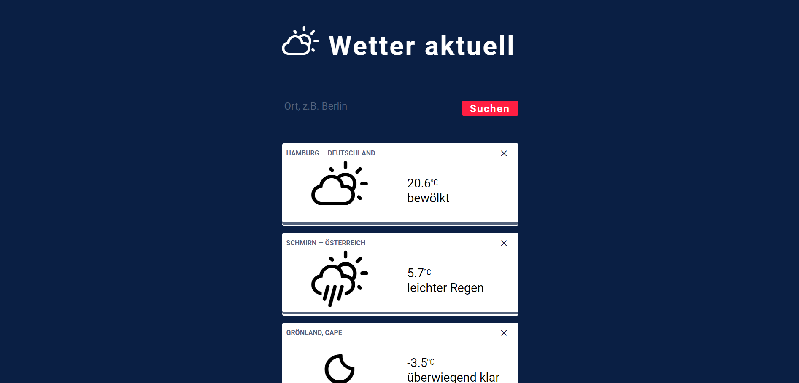

# Weather-App

------

## Preview
| Desktop | Smartphone |
| --- | --- |
|  |  |

## About the Project
This is my first independent Angular project. My objective was to build a simple weather application to primarily explore the following aspects: processing of APIs/JSONs, Angular Material and custom Angular themes. Many features can still be expanded, but I'm satisfied with the foundation.

------

## Technologies

* Angular 17
* Angular Material with Custom Theme/Typography
* [Weather Icons](https://github.com/erikflowers/weather-icons)
* [GeoCoding API](https://open-meteo.com/en/docs/geocoding-api)
* [Weather API](https://open-meteo.com/en/docs)

## Features

* Allows searching for any village/town in the world with autocomplete search suggestions.
* Displays current weather information for multiple places simultaneously.
* Dynamic weather icons reflecting both day/night and current weather conditions.
* Responsive Design.
* Language support: German.

------

## Install

1. Clone the repository.
2. Navigate to the Project Directory: `cd your-repo`.
3. Install Dependencies: `npm install`.

## Development server

Run `ng serve` for a dev server. Navigate to `http://localhost:4200/`. The application will automatically reload if you change any of the source files.